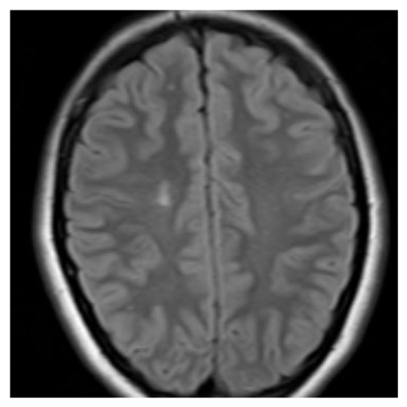
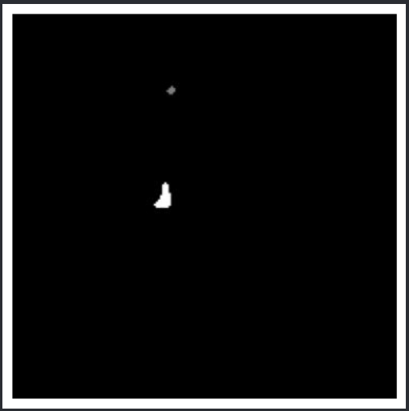
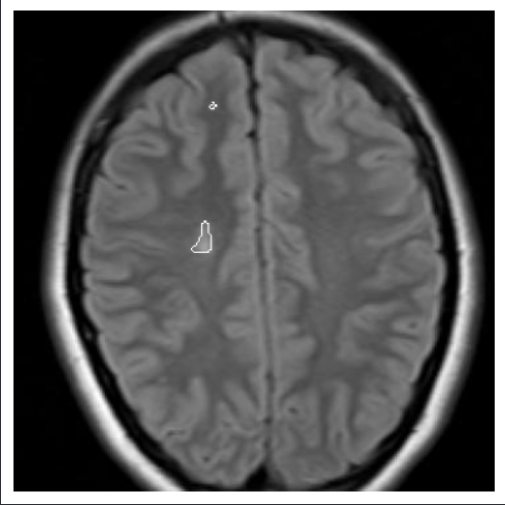
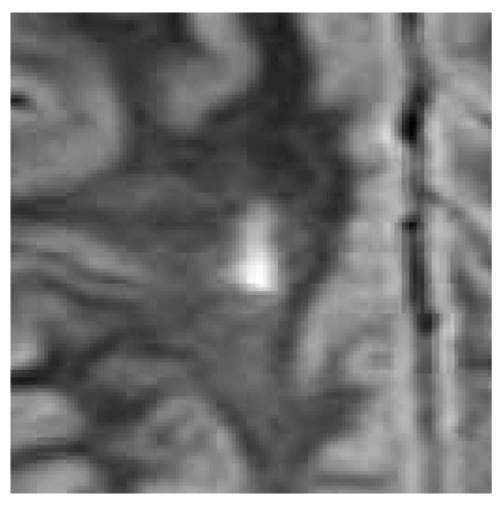
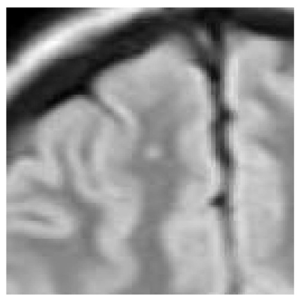

# create_images_rois
Simple jupyter notebook to extract ROI (Region of Interest) for any type of image *using their masks*.
For example, you can use this for extract roi for MIR (Magnetic Resonance Imaging) images, Mammography Ultrasound, etc. 

The algorithm put the mask over original image and use drawContours from OpenCv, 
The default size of the ROI is 128x128 but you can mod according to your needs.
You can define the contours area, this is util if you are looking for larger objects and you want to discard those that do not fit a certain size

## Requirements
- Image (any size)
- Mask (same size as image)
- Libraries (If you don't have installed you can use 'pip install -r requirements.txt')

## Usage
- Set your image path or paths in the notebook
- Execute

## Example
We used the notebook for generate ROI from MIR images

Original image

  

Image mask

  

## Result example
These are the results

Image with contours

  

ROI results 

     

